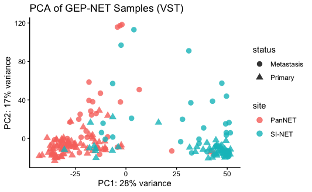
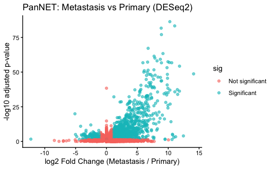
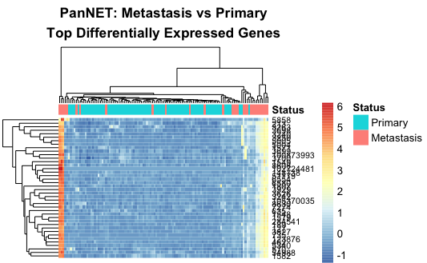
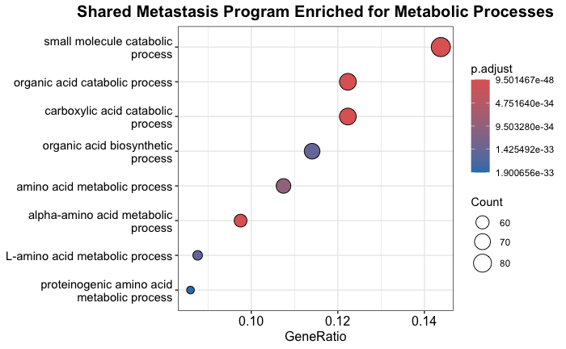

# Neuroendocrine RNA-seq Metastasis Project

**Author:** Tyler Hearnsberger  
**Project type:** Computational biology / bioinformatics portfolio project  
**Dataset:** GEO accession GSE98894  

## Project Overview

This project analyzes publicly available RNA-seq data from gastro-entero-pancreatic neuroendocrine tumors (GEP-NETs). The main goal is to identify transcriptional changes associated with metastasis while accounting for tissue-of-origin differences between pancreatic neuroendocrine tumors (PanNETs) and small-intestinal neuroendocrine tumors (SI-NETs).

The workflow uses raw count data, GEO metadata parsing, DESeq2 normalization and differential expression, PCA-based quality control, heat maps, volcano plots, shared-signature analysis, and Gene Ontology enrichment.

## Main Biological Question

Do metastatic PanNETs and SI-NETs share a conserved transcriptional program, or is metastasis mostly tissue-specific?

## Repository Structure

```text
Neuroendocrine_Project/
├── data/                  # Raw input files go here
├── figures/               # Exported plots
├── results/               # Differential expression tables and gene lists
├── scripts/               # Reusable R scripts
├── report.Rmd             # Main analysis report
├── README.md              # Project overview
├── requirements.txt       # R/Bioconductor package list
└── .gitignore             # Files GitHub should ignore
```

## Required Input Files

Place these files inside the `data/` folder:

```text
GSE98894_raw_counts_GRCh38.p13_NCBI.tsv
GSE98894_series_matrix.txt
```

Large raw datasets should usually not be uploaded directly to GitHub. If the files are too large, keep them locally and describe where they can be downloaded.

## Methods Summary

1. Load raw RNA-seq count matrix.
2. Parse GEO sample metadata from the series matrix file.
3. Classify samples by tissue site:
   - PanNET
   - SI-NET
   - RE-NET
4. Remove rectal NET samples to focus on PanNET and SI-NET.
5. Align metadata with count matrix columns.
6. Create a DESeq2 dataset.
7. Apply variance-stabilizing transformation.
8. Perform global and tissue-specific PCA.
9. Perform DESeq2 differential expression:
   - PanNET metastasis vs primary
   - SI-NET metastasis vs primary
10. Identify shared metastasis-associated genes.
11. Test direction consistency between tissues.
12. Run GO enrichment on shared upregulated metastasis genes.
13. Build a shared metastasis signature score.

## Key Results

The global PCA showed that tissue of origin is the dominant source of transcriptomic variation, separating PanNETs from SI-NETs. Tissue-specific PCA suggested that metastatic PanNETs show greater transcriptional divergence than primary PanNETs, while SI-NET primary and metastatic samples showed more overlap.

Differential expression analysis identified thousands of metastasis-associated genes in both PanNETs and SI-NETs. A subset of genes was shared between the two tumor types and showed consistent directionality, supporting the presence of a conserved metastasis-associated transcriptional program across GEP-NETs.

GO enrichment of shared upregulated metastasis genes suggested enrichment for metabolic and small-molecule biological processes.

### Global PCA

The global PCA demonstrates that tissue-of-origin is the dominant source of transcriptomic variation, separating PanNET and SI-NET samples into distinct clusters.



### Differential Expression Analysis

DESeq2 analysis identified widespread metastasis-associated transcriptional changes in PanNET samples.



### Metastasis-Associated Gene Programs

Heatmap clustering of the top differentially expressed genes demonstrates coordinated transcriptional programs associated with metastatic progression.



### Pathway Enrichment

Shared metastasis-associated genes were enriched for metabolic and small-molecule biological processes.



## Tools Used

- R
- DESeq2
- tidyverse
- ggplot2
- pheatmap
- clusterProfiler
- org.Hs.eg.db
- apeglm

## Portfolio Note

This project demonstrates practical skills in RNA-seq preprocessing, metadata cleaning, differential expression analysis, data visualization, pathway enrichment, and biological interpretation.
